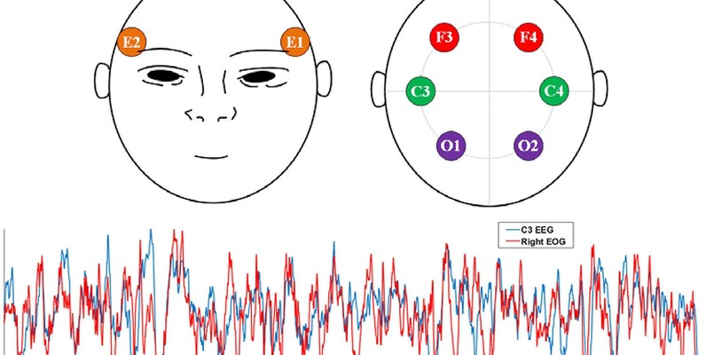

# Sleep Stage Classification using Temporal Convolutional Networks 😴🧠

A deep learning implementation for automatic sleep stage classification using Temporal Convolutional Networks (TCN) on EEG data from the Sleep-EDF database. This project demonstrates the application of advanced neural network architectures for analyzing polysomnography signals.



## 📋 Description

This project implements an automatic sleep stage classification system using Temporal Convolutional Networks (TCN) trained on EEG signals from the Sleep-EDF Expanded database. The model classifies 30-second EEG epochs into five sleep stages: Wake, N1, N2, N3, and REM sleep.

The implementation includes complete data preprocessing pipeline, TCN model architecture with causal and dilated convolutions, training with early stopping and learning rate scheduling, and comprehensive evaluation metrics.

<br>
<div align="center">
  <a href="https://codeload.github.com/yourusername/sleep-stage-classification-tcn/legacy.zip/main">
    
  </a>
</div>

## 🎯 Project Objectives

1. **Process EEG Data**: Load and preprocess polysomnography recordings from Sleep-EDF database
2. **Segment Signals**: Extract 30-second epochs with corresponding sleep stage labels
3. **Build TCN Model**: Implement temporal convolutional network with dilated convolutions
4. **Train Classifier**: Optimize model using Adam optimizer with callbacks
5. **Evaluate Performance**: Comprehensive metrics including confusion matrix and per-class analysis
6. **Analyze Results**: Identify challenging sleep stages and misclassification patterns

## ✨ Features

### Data Processing
- **Automatic Download**: Downloads PSG and hypnogram files from PhysioNet
- **EEG Extraction**: Processes EDF files using MNE-Python library
- **Epoch Segmentation**: Splits continuous recordings into 30-second windows
- **Label Mapping**: Converts annotations to numeric sleep stage labels
- **Normalization**: StandardScaler normalization for each epoch

### Model Architecture
- **Temporal Convolutional Blocks**: 5 TCN blocks with increasing dilation rates
- **Causal Convolutions**: Preserves temporal ordering of EEG signals
- **Dilated Convolutions**: Large receptive field (1, 2, 4, 8, 16)
- **Residual Connections**: Skip connections for better gradient flow
- **Dropout Regularization**: Prevents overfitting (0.2-0.4 dropout rates)

### Training Features
- **Early Stopping**: Monitors validation loss with 15-epoch patience
- **Learning Rate Scheduling**: ReduceLROnPlateau with 0.5 factor
- **Model Checkpointing**: Saves best model based on validation loss
- **Class Distribution**: Handles imbalanced sleep stage distribution

### Evaluation Metrics
- **Accuracy**: Overall classification accuracy
- **Precision/Recall/F1**: Per-class performance metrics
- **Confusion Matrix**: Visualization of predictions vs ground truth
- **Misclassification Analysis**: Identifies common classification errors
- **Confidence Distribution**: Analyzes model prediction confidence

## 🔬 Methodology

### Dataset: Sleep-EDF Expanded

**Source**: PhysioNet Sleep-EDF Database Expanded  
**Subjects**: 3 healthy subjects (6 recordings total)  
**Recording Type**: Whole-night polysomnography  
**Channel Used**: EEG Fpz-Cz (single channel)  
**Sampling Frequency**: 100 Hz  
**Epoch Duration**: 30 seconds (3000 samples per epoch)

### Sleep Stage Mapping

| Original Label | Numeric Label | Stage Name | Description |
|----------------|---------------|------------|-------------|
| Sleep stage W | 0 | Wake | Awake/alert state |
| Sleep stage 1 | 1 | N1 | Light sleep (transition) |
| Sleep stage 2 | 2 | N2 | Light sleep (main) |
| Sleep stage 3/4 | 3 | N3 | Deep sleep (SWS) |
| Sleep stage R | 4 | REM | Rapid Eye Movement |

### TCN Architecture

```
Input: (batch_size, 3000, 1) - Single-channel EEG epoch

TCN Block 1: 32 filters, dilation=1
TCN Block 2: 32 filters, dilation=2
TCN Block 3: 64 filters, dilation=4
TCN Block 4: 64 filters, dilation=8
TCN Block 5: 128 filters, dilation=16

Global Average Pooling
Dense Layer: 64 units, ReLU
Dropout: 0.4
Output Layer: 5 units, Softmax

Total Parameters: 145,765
```

**Key Features:**
- **Causal Convolutions**: No future information leakage
- **Residual Connections**: 1x1 convolution for dimension matching
- **Large Receptive Field**: Covers entire 30-second epoch
- **Parameter Efficiency**: Fewer parameters than RNN/LSTM models

## 📊 Results

### Overall Performance

| Metric | Value |
|--------|-------|
| **Test Accuracy** | 68.79% |
| **Test Loss** | 0.7524 |
| **Weighted Precision** | 0.6819 |
| **Weighted Recall** | 0.6879 |
| **Weighted F1-Score** | 0.6774 |

### Per-Class Performance

| Sleep Stage | Precision | Recall | F1-Score | Support | Accuracy |
|-------------|-----------|--------|----------|---------|----------|
| **Wake** | 0.7273 | 0.6667 | 0.6957 | 12 | 66.67% |
| **N1** | 0.6786 | 0.6129 | 0.6441 | 31 | 61.29% |
| **N2** | 0.6444 | 0.6591 | 0.6517 | 44 | 65.91% |
| **N3** | 0.7308 | 0.8837 | 0.8000 | 43 | 88.37% |
| **REM** | 0.6000 | 0.2727 | 0.3750 | 11 | 27.27% |

### Classification Difficulty Ranking

1. **N3 (Deep Sleep)**: 88.37% - Easy ✅
2. **Wake**: 66.67% - Moderate ⚠️
3. **N2 (Light Sleep)**: 65.91% - Moderate ⚠️
4. **N1 (Transition)**: 61.29% - Moderate ⚠️
5. **REM**: 27.27% - Difficult ❌

### Most Common Misclassifications

| True Stage | Predicted As | Count | Percentage |
|------------|--------------|-------|------------|
| REM | N1 | 4 | 36.36% |
| REM | N2 | 4 | 36.36% |
| N2 | N3 | 12 | 27.27% |
| Wake | N1 | 3 | 25.00% |
| N1 | N2 | 7 | 22.58% |

### Key Observations

**Strong Performance:**
- N3 (deep sleep) classification is highly accurate (88%)
- Strong distinction of deep sleep from other stages
- Good precision across most stages (>0.64)

**Challenges:**
- REM sleep is the most difficult to classify (27% recall)
- REM is often confused with N1 and N2 stages
- Transitional stages (N1) show moderate performance
- Adjacent sleep stages are frequently misclassified

**Reasons for Difficulty:**
1. **REM-N1 Similarity**: Both show mixed frequency patterns
2. **Class Imbalance**: REM has fewer samples (70 vs 291 N2)
3. **Transitional Nature**: N1 is a brief transition stage
4. **Single Channel**: Using only one EEG channel limits information
5. **Small Dataset**: Only 935 epochs from 3 subjects

## 🚀 Getting Started

### Prerequisites

**Python Environment:**
```
Python 3.7+
Google Colab (recommended)
```

**Required Libraries:**
```
mne >= 1.0.0
scipy >= 1.7.0
numpy >= 1.21.0
pandas >= 1.3.0
matplotlib >= 3.4.0
seaborn >= 0.11.0
scikit-learn >= 0.24.0
tensorflow >= 2.8.0
requests
tqdm
```

### Installation

1. **Open in Google Colab**
```
Upload the notebook to Google Colab
Mount Google Drive for data storage
```

2. **Install Dependencies**
```python
!pip install -q mne scipy matplotlib seaborn scikit-learn
```

3. **Run All Cells**
```
Execute cells sequentially from top to bottom
Data will be downloaded automatically
```

### Usage

**Step 1: Mount Google Drive**
```python
from google.colab import drive
drive.mount('/content/drive')
```

**Step 2: Download Dataset**
```python
# Files are downloaded automatically from PhysioNet
# Progress bars show download status
# Files saved to /content/drive/MyDrive/sleep_edf_data/
```

**Step 3: Process Data**
```python
# Load EEG data from PSG files
# Load annotations from hypnogram files
# Segment into 30-second epochs
# Normalize using StandardScaler
```

**Step 4: Train Model**
```python
# Build TCN architecture
# Compile with Adam optimizer
# Train with callbacks (early stopping, LR scheduling)
# Best model saved automatically
```

**Step 5: Evaluate**
```python
# Test set evaluation
# Confusion matrix generation
# Per-class metrics calculation
# Misclassification analysis
```

## 🧮 Technical Implementation

### Data Preprocessing Pipeline

```python
# 1. Load EEG from EDF file
raw = mne.io.read_raw_edf(psg_file, preload=True)
raw.pick_channels(['EEG Fpz-Cz'])

# 2. Load annotations
annotations = mne.read_annotations(hypno_file)

# 3. Segment into epochs
epoch_length = 30 * sampling_frequency  # 3000 samples
epochs = []
for onset, duration, label in annotations:
    start = int(onset * sfreq)
    end = start + epoch_length
    epoch = eeg_data[start:end]
    epochs.append(epoch)

# 4. Normalize
from sklearn.preprocessing import StandardScaler
scaler = StandardScaler()
normalized = scaler.fit_transform(epoch.reshape(-1, 1)).flatten()
```

### TCN Block Implementation

```python
class TemporalConvBlock(layers.Layer):
    def __init__(self, filters, kernel_size, dilation_rate, dropout_rate):
        super().__init__()
        
        # Causal dilated convolution
        self.conv1 = layers.Conv1D(
            filters=filters,
            kernel_size=kernel_size,
            dilation_rate=dilation_rate,
            padding='causal',
            activation='relu'
        )
        self.dropout1 = layers.Dropout(dropout_rate)
        
        # Second causal convolution
        self.conv2 = layers.Conv1D(
            filters=filters,
            kernel_size=kernel_size,
            dilation_rate=dilation_rate,
            padding='causal',
            activation='relu'
        )
        self.dropout2 = layers.Dropout(dropout_rate)
        
        # Residual connection
        self.downsample = layers.Conv1D(filters=filters, kernel_size=1)
    
    def call(self, inputs, training=False):
        x = self.conv1(inputs)
        x = self.dropout1(x, training=training)
        x = self.conv2(x)
        x = self.dropout2(x, training=training)
        
        # Add residual
        res = self.downsample(inputs)
        return layers.Add()([x, res])
```

### Training Configuration

```python
# Optimizer
optimizer = keras.optimizers.Adam(learning_rate=0.001)

# Callbacks
callbacks = [
    keras.callbacks.EarlyStopping(
        monitor='val_loss',
        patience=15,
        restore_best_weights=True
    ),
    keras.callbacks.ReduceLROnPlateau(
        monitor='val_loss',
        factor=0.5,
        patience=5,
        min_lr=1e-6
    ),
    keras.callbacks.ModelCheckpoint(
        filepath='best_tcn_model.h5',
        monitor='val_loss',
        save_best_only=True
    )
]

# Training
history = model.fit(
    X_train, y_train,
    validation_data=(X_val, y_val),
    epochs=100,
    batch_size=64,
    callbacks=callbacks
)
```

## 🎓 Learning Outcomes

This project demonstrates:

1. **Deep Learning for Biosignals**: Applying neural networks to physiological signals
2. **Temporal Convolutional Networks**: Architecture for sequence modeling
3. **EEG Signal Processing**: Working with polysomnography data
4. **Medical Data Handling**: Loading and processing EDF files
5. **Class Imbalance**: Dealing with unbalanced sleep stage distribution
6. **Model Evaluation**: Comprehensive metrics for multi-class classification
7. **TensorFlow/Keras**: Building custom layers and training loops

## 🔄 Why TCN for Sleep Stage Classification?

**Advantages:**

1. **Long-Range Dependencies**: Dilated convolutions capture patterns across entire 30-second epochs
2. **Parallel Processing**: Unlike RNNs, TCN processes sequences in parallel → faster training
3. **Causal Structure**: Respects temporal ordering, no future information leakage
4. **Parameter Efficiency**: Fewer parameters than LSTM/GRU for same receptive field
5. **Stable Gradients**: No vanishing/exploding gradient problems of RNNs
6. **Flexible Architecture**: Easy to adjust receptive field by changing dilation rates

**Comparison with Other Architectures:**

| Architecture | Training Speed | Parameters | Accuracy | Long-Range Deps |
|--------------|----------------|------------|----------|-----------------|
| **TCN** | Fast ⚡ | Low 📉 | Good ✅ | Excellent 🌟 |
| **LSTM** | Slow 🐌 | High 📈 | Good ✅ | Good ✓ |
| **CNN** | Fast ⚡ | Low 📉 | Moderate ⚠️ | Limited ❌ |
| **Transformer** | Moderate ⏱️ | Very High 📊 | Excellent 🌟 | Excellent 🌟 |

## 💡 Potential Improvements

1. **Dataset Expansion**:
   - Use all 197 recordings from Sleep-EDF database
   - Include data from multiple sleep labs
   - Balance class distribution with data augmentation

2. **Multi-Channel Input**:
   - Incorporate multiple EEG channels (C3-A2, O1-A2)
   - Add EOG (eye movement) and EMG (muscle activity) channels
   - Use channel-wise feature extraction

3. **Architecture Enhancements**:
   - Experiment with deeper TCN networks
   - Try attention mechanisms
   - Implement multi-scale TCN blocks
   - Add batch normalization layers

4. **Data Augmentation**:
   - Time warping
   - Magnitude scaling
   - Gaussian noise injection
   - Mixup between epochs

5. **Class Imbalance Handling**:
   - Weighted loss function
   - SMOTE oversampling
   - Focal loss implementation
   - Class-balanced sampling

6. **Transfer Learning**:
   - Pre-train on larger sleep datasets
   - Fine-tune on specific patient populations
   - Domain adaptation techniques

## 🤝 Contributing

Contributions are welcome! Potential areas:

- Add support for multi-channel EEG
- Implement additional architectures (Transformers, BiLSTM)
- Improve data augmentation techniques
- Create real-time inference pipeline
- Add interpretability visualizations (Grad-CAM)

## 📄 License

This project is licensed under the MIT License - see the [LICENSE](LICENSE) file for details.

## 🙏 Acknowledgments

- PhysioNet for providing the Sleep-EDF Expanded database
- MNE-Python library for EEG data processing
- TensorFlow/Keras for deep learning framework
- Sleep research community for establishing annotation standards

<br>
<div align="center">
  <a href="https://codeload.github.com/yourusername/sleep-stage-classification-tcn/legacy.zip/main">
    
  </a>
</div>

## <!-- CONTACT -->
<div id="toc" align="center">
  <ul style="list-style: none">
    <summary>
      <h2 align="center">
        🚀
        CONTACT ME
        🚀
      </h2>
    </summary>
  </ul>
</div>
<table align="center" style="width: 100%; max-width: 600px;">
<tr>
  <td style="width: 20%; text-align: center;">
    <a href="https://www.linkedin.com/in/amr-ashraf-86457134a/" target="_blank">
      
    </a>
  </td>
  <td style="width: 20%; text-align: center;">
    <a href="https://github.com/TendoPain18" target="_blank">
      
    </a>
  </td>
  <td style="width: 20%; text-align: center;">
    <a href="mailto:amrgadalla01@gmail.com">
      
    </a>
  </td>
  <td style="width: 20%; text-align: center;">
    <a href="https://www.facebook.com/amr.ashraf.7311/" target="_blank">
      
    </a>
  </td>
  <td style="width: 20%; text-align: center;">
    <a href="https://wa.me/201019702121" target="_blank">
      
    </a>
  </td>
</tr>
</table>
<!-- END CONTACT -->

## **Unlock the science of sleep through deep learning! 😴✨**
